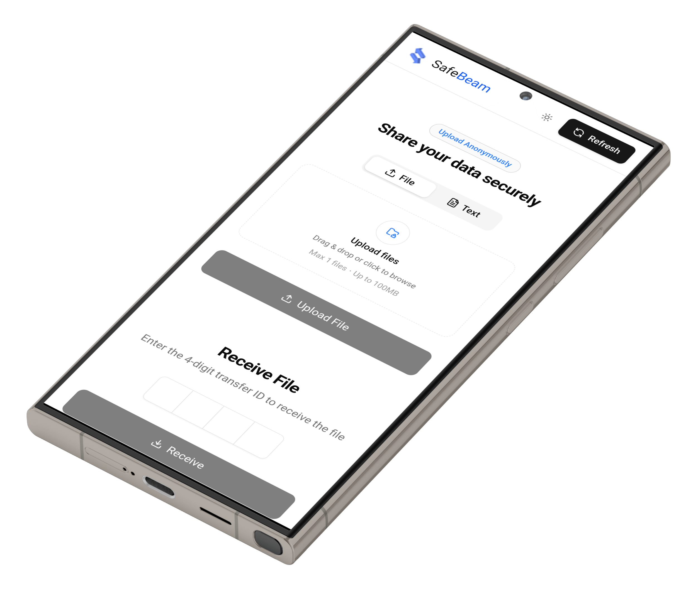
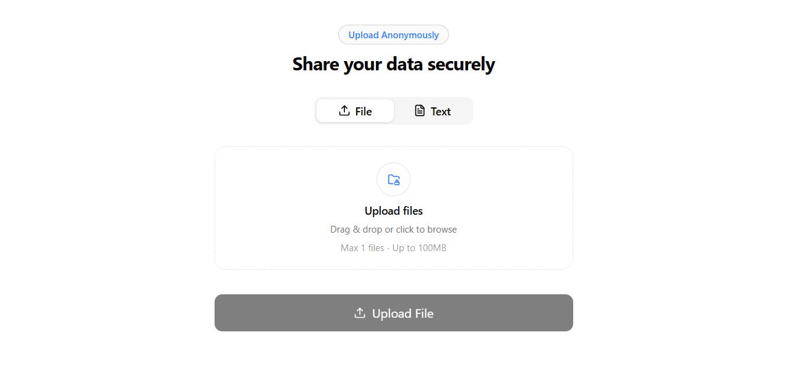
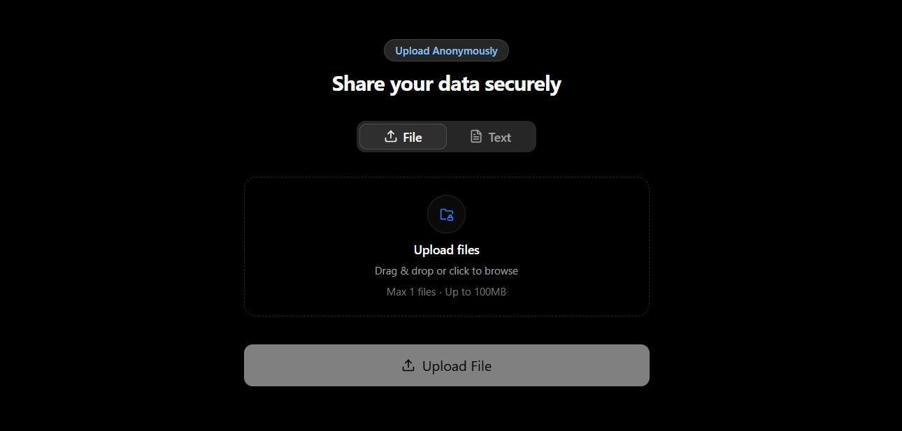

# 🚀 SafeBeam — Secure One-Time File & Text Sharing (No Signup)

**SafeBeam** is a fast, secure, and privacy-focused web application that allows users to **send files or text instantly using a one-time OTP valid for 10 minutes**.  
No sign-up, no device limits, and no permanent links — works seamlessly across all platforms.

🌍 **Live Website:** https://safebeam03.vercel.app/  
💻 **GitHub Repository:** https://github.com/TanayHingane/SafeBeam03

---

## 🔥 Why SafeBeam?

Traditional file-sharing platforms often require:
- Account creation
- App installation
- Email verification
- Long-lived or permanent links

**SafeBeam removes all unnecessary friction** and focuses on speed, simplicity, and security.

✅ One-time OTP access  
✅ Auto-expiry after 10 minutes  
✅ No login required  
✅ All file types supported  
✅ Works on any device or browser  

---

## ✨ Features

- 🔐 **One-Time OTP Security**  
  Each transfer generates a unique OTP that expires automatically after **10 minutes**

- ⚡ **Instant File & Text Sharing**  
  Share documents, images, videos, ZIPs, or quick text notes instantly

- 🧠 **No Signup Required**  
  Completely anonymous usage — no accounts, no emails, no tracking

- 🌍 **Cross-Platform Compatibility**  
  Works on mobile, desktop, tablet, and all modern browsers

- 📁 **Supports All File Types**  
  PDFs, images, videos, code files, archives, and more

- 🌓 **Light & Dark Mode**  
  Clean, modern UI with theme support

- 🚀 **High Performance**  
  Built with Next.js App Router and optimized static assets

---

## 🛡️ Security & Privacy

SafeBeam is designed with **privacy-first principles**:

- OTPs auto-expire after **10 minutes**
- No permanent links
- No stored user identity
- No device or platform restrictions
- Minimal data retention

Ideal for:
- Sensitive document sharing
- One-time file transfers
- Temporary access use cases
- Secure personal or professional sharing

---

## 🛠️ Technologies Used

- **Next.js 14+ (App Router)**
- **React 18**
- **TypeScript**
- **Tailwind CSS**
- **Context API**

---

## 🧩 Project Structure

SafeBeam03/
├── public/ # Static assets (images, icons)
├── contexts/ # Context API state management
├── src/ # Components and pages
├── starter-for-nextjs/ # Optional starter template
├── .gitignore
├── next.config.ts
├── tsconfig.json
├── package.json
└── README.md

---

## 📸 Screenshots

| Light Mode                   | Dark Mode                  |
| ---------------------------- | -------------------------- |
|  |  |

---

## 🌟 Use Cases

- **Send files between phone and laptop**
- **Share sensitive documents securely**
- **Temporary client file sharing**
- **One-time access links**
- **Quick text or code snippet sharing**

---

## 🤝 Contributing

**Contributions are welcome!
If you have ideas to improve security, UI, or performance, feel free to:**

- **Fork the repository**
- **Create a new branch**
- **Submit a pull request 🚀**

---

## 📄 License

**This project is licensed under the MIT License.**

---

## 📬 Contact

**👨‍💻 Created by: Tanay Hingane** 
**📧 Email: safebeam03@gmail.com**

---

## If you find this project useful:

- **⭐ Star the repository**
- **🔁 Share it with others**
- **🧵 Post about it on LinkedIn / Twitter**
